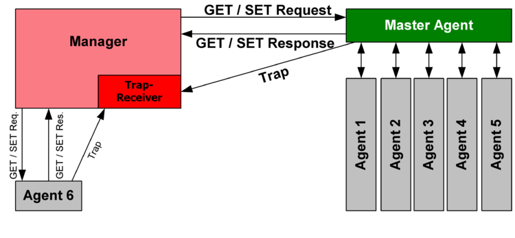
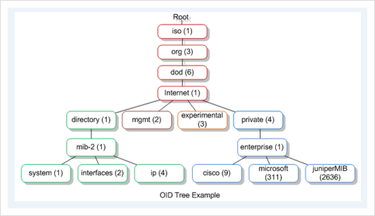

- TCP/IP 를 이용하여 네트워크 자원 관리를 위해 사용하는 프로토콜
- 네트워크 디바이스의 다양한 정보를 원격지에서 수집 또는 운영할 수 있도록 지원한다.
- 다양한 버전의 SNMP 가 개발되어 있다. (SNMPv1, SNMPv2, SNMPv3)

Overview and basic concept

- Managed device : 네트워크에 연결된 SNMP 인터페이스를 가지고 있는 장치
- Agent : managed device 에서 동작하는 소프트웨어
- network management station : SNMP를 이용하여 managed device를 모니터링 및 제어함

Management information base (MIB)

- SNMP로 관리하는 managed device의 변수들에 대한 정보
- 계층적인 구조로 구성
- 각 정보는 object identifier (OID)로 구분한다.

Protocol details

- UDP 161 : manager 가 managed device에 query 요청 시 사용하는 포트
- UDP 162 : managed device 가 manage에게 notification (trap 또는 inform) 를 전달할 때 사용하는 포트
- SNMP PDU 구성도
    
    `IP header | UDP header | version | community | PDU-type | request-id | error-status | error_index | variable bindings`
    
- GetRequest : 특정 변수 만 조회
- SetRequest : 특정 변수 또는 변수 리스트에 대한 값을 설정
- GetNextRequest : 사전에 정의된 순서에 따라 요청에 포함된 변수의 다음 변수의 값을 조회
- GetBulkRequest : 여러개의 GetNextRequest 를 한번에 처리
- Response : Get 요청들에 대한 응답
- Trap : agent 에서 manager로 보내는 상태 값
- InformRequst : Trap과 동일하나 manager로 부터 응답을 받아 메시지 전송을 보장한다.
- SNMP 메시지는 최소 484 바이트의 길이를 가져야 하고 유효하진 않는 요청은 버린다.
- 각 read-only,  read-write, trap에 해당하는 community string 을 설정한다.

SNMPv1

- SNMP 프로토콜의 원형으로 1980년대 개발 시작 하였고 RFC 문서는 1988년도에 발행
- 보안에 취약한 문제가 있다.

SNMPv2

- GetBulkRequest 요청이 개발됨
- SNMPv1의 단점인 보안 기능을 개발하였으나 너무 복잡하여 사용되지 않음
- Community-Based SNMP (SNMPv2c) 이 사실상 표준 으로 자리 잡음
- User-Based SNMP (SNMPv2u) 가 일부 보안 기능을 제공함
- 64bit counters 를 지원함

SNMPv1 과 SNMPv2의 비호환

- SNMPv1과 SNMPv2의 호환되지 않는 문제를 해결하기 위해 SNMP proxy 와 Bilingual NMS 을 사용한다.

SNMPv3

- SNMPv2와의 차이점은 보안 요소가 추가된 점이다.
- 메시지의 기밀성, 인증 및 무결성 을 보장한다.
- User-based Model(USM), View-based Access Control(VACM),  Transport Security Model(TSM) 기능 제공

신입사원으로 유비쿼스에 입사하고 그 시기부터 담당 업무로 배정받은 모듈이 SNMP 이다. 당시에 다른 팀원들이 말하길 SNMP 는 스위치 장비에서 비중이 적은 모듈이라고 말을 하였고 그리 어렵지 않다고 말을 했었다. 하지만 다른 팀원들이 그리 말할 수 있었던 이유는 SNMP 처리 코드의 정말 일부분만 보고 말했던 것이다. 사수의 도움 없이 net-snmp 코드를 분석하면서 느껴지던 것 오직 막막함 이었다. 지금도 신입사원이 누구의 도움이 없이 코드를 분석하기에는 너무 난이도가 높다고 생각한다. 그래도 어떻게든 버티고 분석해서 주어진 일을 수행하기는 했지만 정말 힘들었던 시간이다. ㅠ

